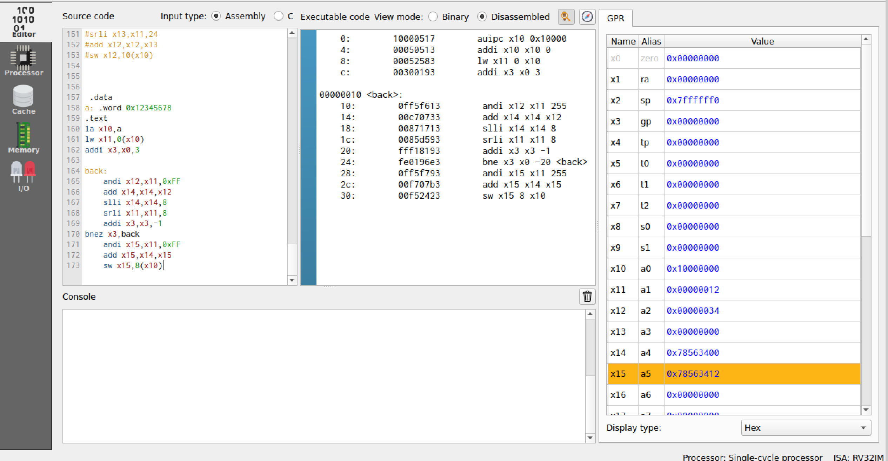
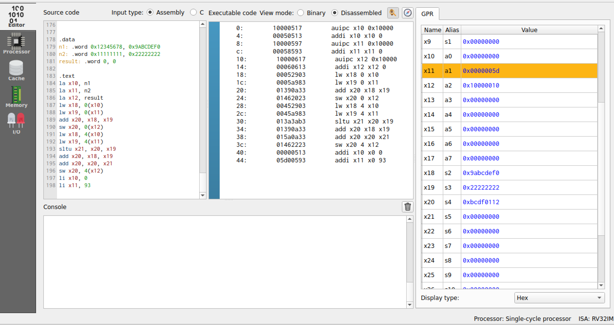

# Program 1: 
### Statement: 
Convert a 32-bit value from Little Endian to Big Endian format using RISC-V assembly

### Name of file:
program1.s

### Observation - Explanation
- The program takes a 32-bit number stored in little-endian format and rearranges its bytes to convert it into big-endian format.
- It uses bitwise operations (`AND`, `SLL`, and `SRLI`) and looping to extract individual bytes and store them in the correct order in memory.
- The result is stored in the memory location pointed to by `c` in big-endian format.

### Observation - Single Cycle
- **Cycles: 39 
- **Frequency: 10.53 Hz
- **CPI: 1
- **IPC: 1
### Observation - 5 Stage
- **Cycles: 49
- **Frequency:  10.75 Hz
- **CPI: 1.26
- **IPC: 0.796

### Memory Mapping
- 0x10000000: 0x12345678 
- 0x10000004: 0x000000ff   
- 0x10000008: 0x78563412   

### Register Mapping
- **x10: 0x10000000
- **x11: 0x10000004
- **x12: 0x00000000
- **x13: 0x000000ff
- **x14: 0x00000012
- **x15: 0xfffffff8
- **x17: 0x10000008
- **x18: 0x10000007
- **x19: 0xfffffff8

### Snapshot

# Program 2: 
### Statement: 
Write an Assembly Program for addition of 2 64-bit numbers on RV32I

### Name of file:
program2.s

### Observation - Explanation
- The program performs addition of two 64-bit integers using the RV32I instruction set by splitting each 64-bit number into two 32-bit parts (higher and lower words).
- It computes the lower-word addition first, handling carry if it occurs, and then adds the higher words.
- The result is stored in two separate registers or memory locations for the higher and lower words of the 64-bit sum.

### Observation - Single Cycle
- **Cycles: 14
- **Frequency: 11.11 Hz
- **CPI: 1
- **IPC: 1
### Observation - 5 Stage
- **Cycles: 18
- **Frequency:  10.31 Hz
- **CPI: 1.29
- **IPC: 0.778

### Memory Mapping
- 0x10000000: 0xffffffff 
- 0x10000004: 0xffffffff   
- 0x10000008: 0xffffffff  
- 0x1000000c: 0xffffffff 
- 0x10000010: 0xfffffffe  
- 0x10000014: 0xffffffff 

### Register Mapping
- **x10: 0x10000000
- **x11: 0x10000010
- **x12: 0xffffffff
- **x13: 0xffffffff
- **x14: 0xffffffff
- **x15: 0xffffffff
- **x16: 0xfffffffe
- **x17: 0x00000001
- **x18: 0xffffffff 

### Snapshot

