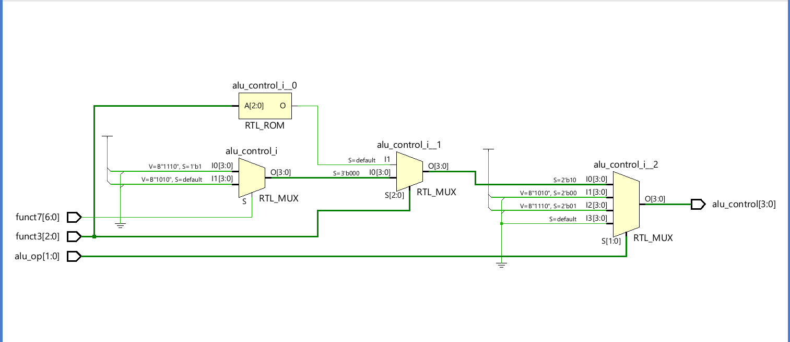

# Program 1: 
### Statement: Write a SV program for Control unit

### Name of file:
CU.sv
### RTL Snapshot

# Program 2: 
### Statement: Write a SV program for alu Control

### Name of file:
alu_control.sv
### RTL Snapshot

