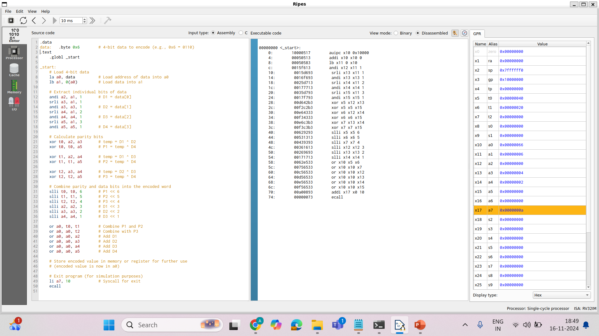

# Program 1:
 
### Statement: 
Write an assembly program to check if a given number is a 2-out-of-5 number

### Name of file:
program1.s

### Observation - Explanation
- The program reads a binary number and checks for exactly two bits set to `1` among five bits. 
- It uses bitwise operations to count the `1`s in the binary representation. 
- Outputs whether the number is a valid 2-out-of-5 number.

### Snapshot

---

# Program 2: 
### Statement:
Write an assembly program to encode a given number using Hamming Code.

### Name of file:
program2.s

### Observation - Explanation
- The program calculates parity bits to ensure error detection and correction.
- It uses the Hamming Code algorithm to generate an encoded number with the appropriate parity bits. 
- Outputs the encoded number for transmission or storage.

### Snapshot

---
