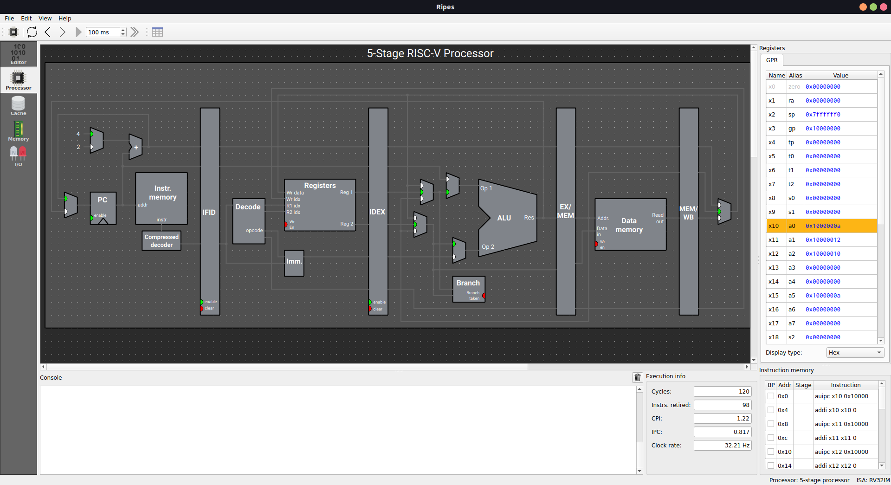

# Week 5 - Assembly Assignment
	1. Write an assembly program to check whether a given number in an array of elements is divisible by 9
	2. Write an Assembly Program for the following C code:
	```c
main() {
	unsigned short int a[11] = {0x1234, 0x5678, ...};
	unsigned short int b[11] = {0x1234, 0x5678, ...};
	unsigned short int c[11] = {0x1234, 0x5678, ...};
	for(i = 0; i < 10; i++)
	{
		c[i] = a[i] * b[i] + c[i-1];
	}
}
	```
# Program 1:
### Statement: Convert a 32-bit value from Little Endian to Big Endian format using RISC-V assembly 

### Name of file:
[src/p5_a.s](src/p5_a.s)

### Snapshot


# Program 2:
### Statement: Write an Assembly Program for the following C code:

### Name of file:
[src/p5_b.s](src/p5_b.s)

### Snapshot


