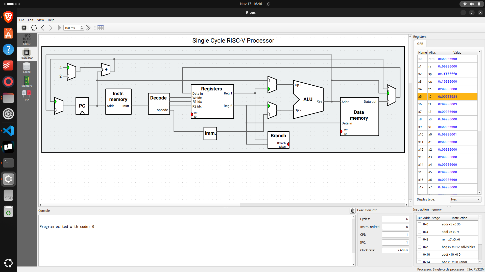
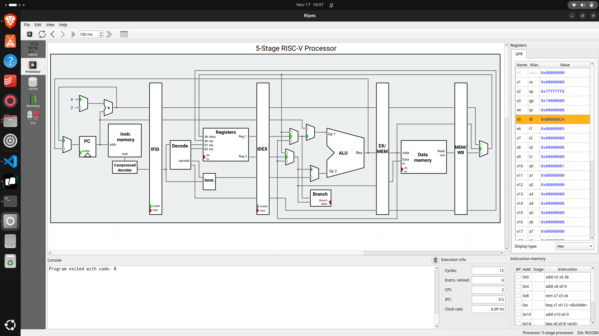

# Program 1: 
### Statement: Write an assembly program to check whether a given number in an array of elements is divisible by 9

### Name of file:
[program1.s](./program1.s)

### Observation - Explanation
- In the single cycle implementation, the program completes in 6 cycles with a frequency of 2.91 Hz, resulting in a CPI of 1 and an IPC of 1. This indicates that each instruction takes one cycle to execute.
- In the 5 stage pipeline implementation, the program completes in 12 cycles with a frequency of 6.09 Hz, resulting in a CPI of 2 and an IPC of 0.5. This shows that while the pipeline increases the frequency, it also increases the number of cycles per instruction due to pipeline stages and potential hazards.
- The single cycle implementation is simpler but slower, while the 5 stage pipeline is more complex but can achieve higher throughput despite the increased cycle count per instruction.
- The screenshots illustrate the differences in execution between the two implementations, highlighting the trade-offs between simplicity and performance.

### Observation - Single Cycle
- **Cycles:** 6
- **Frequency:** 2.91 Hz
- **CPI:** 1
- **IPC:** 1

### Observation - 5 Stage
- **Cycles:** 12
- **Frequency:** 6.09 Hz
- **CPI:** 2
- **IPC:** 0.5

### Snapshot

