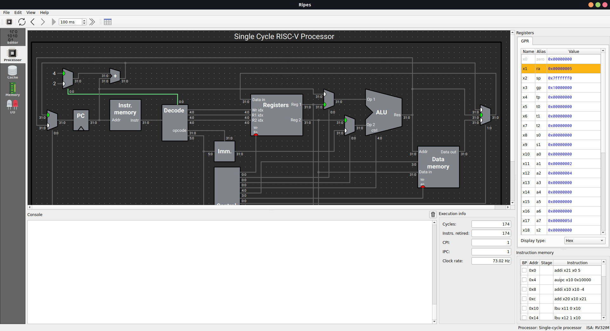
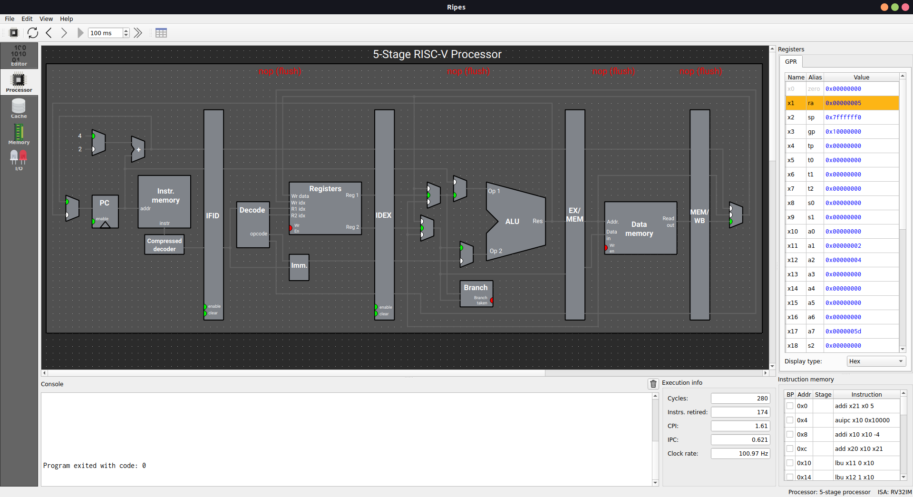
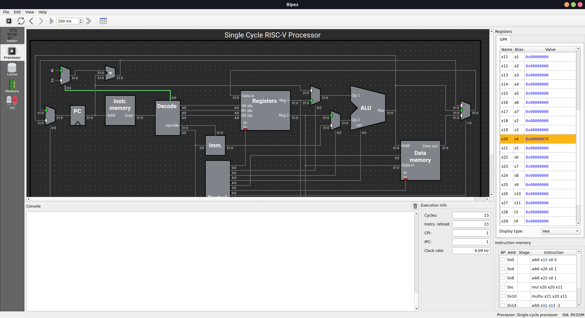
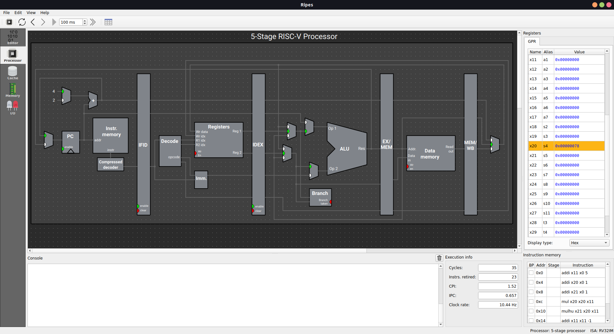
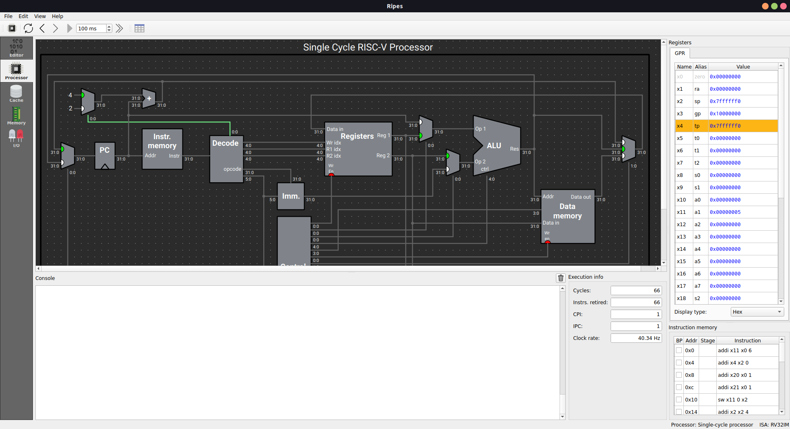
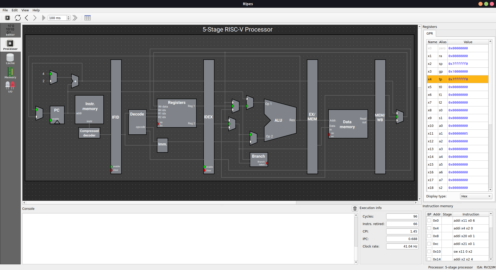

# Week 6 - Assembly Assignment

1. Write an assembly program to sort an array using bubble sort to sort N-elements
[src/p6_a.s](src/p6_a.s)

### Snapshot

2. Write an assembly program to calculate the factorial of a number with & without recursion
- [Without recursion](src/p6_b_a.s)
- [With recursion](src/p6_b_b.s)

### Snapshot
#### Without recusrion

#### With recusrion

3. Write an assembly program to do matrix multiplication
