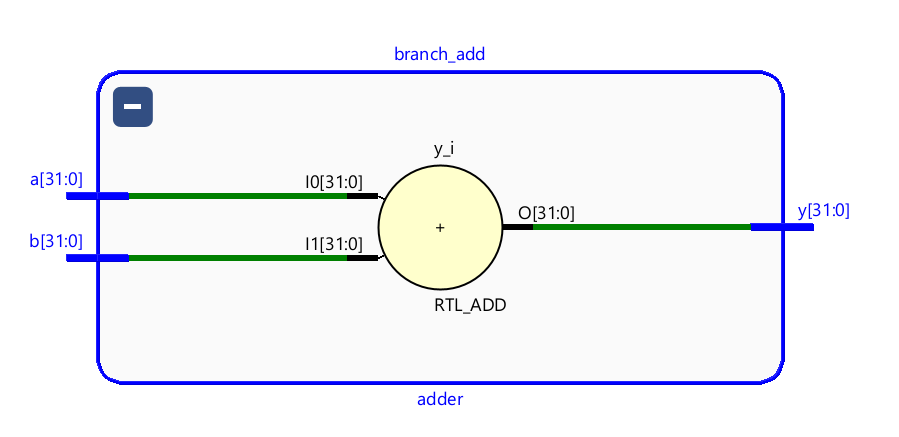

# Program 1: 
### Statement: 1. Write a SV program for Asynchronous Reset Flip Flop

### Name of file:
COD-Lab/week6/w6p1.sv

### RTL Snapshot

# Program 2: 
### Statement: 2. Write a SV program for Synchronous Reset Flip Flop

### Name of file:
COD-Lab/week6/w6p2.sv

### RTL Snapshot

# Program 3: 
### Statement: 3. Write a SV program for 3:1 MUX

### Name of file:
COD-Lab/week6/w6p3.sv

### RTL Snapshot

# Program 4: 
### Statement: 4. Write a SV program for 2:1 MUX

### Name of file:
COD-Lab/week6/w6p4.sv

### RTL Snapshot

# Program 5: 
### Statement: 5. Write a SV program for Adder

### Name of file:
COD-Lab/week6/w6p5.sv

### RTL Snapshot

# Program 6: 
### Statement: 6. Write a SV program for Instruction Fetch Stage

### Name of file:
COD-Lab/week6/w6p6.sv

### RTL Snapshot

# Program 7: 
### Statement: 7. Write a SV program for Instruction Memory

### Name of file:
COD-Lab/week6/w6p7.sv

### RTL Snapshot

