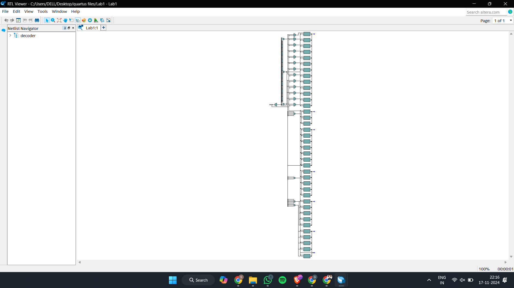
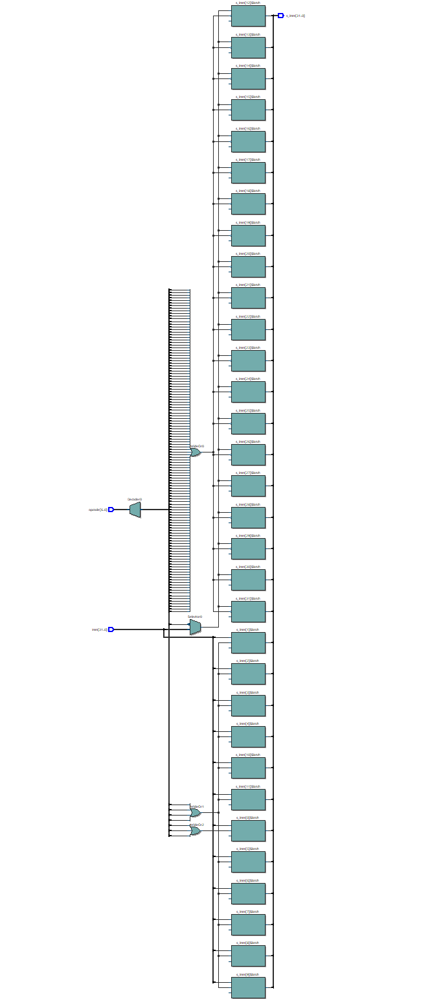

# Program 1: 
### Statement: Write a SV program for Instruction Decode Stage

### Name of file:
topdecode.sv

### RTL Snapshot

# Program 2: 
### Statement: Write a SV program for the Decoder

### Name of file:
dec.sv

### RTL Snapshot

# Program 3: 
### Statement: Write a SV program for the Register File

### Name of file:
register.sv

### RTL Snapshot

# Program 4: 
### Statement: Write a SV program for the Immediate Unit

### Name of file:
sign_ext.sv

### RTL Snapshot

