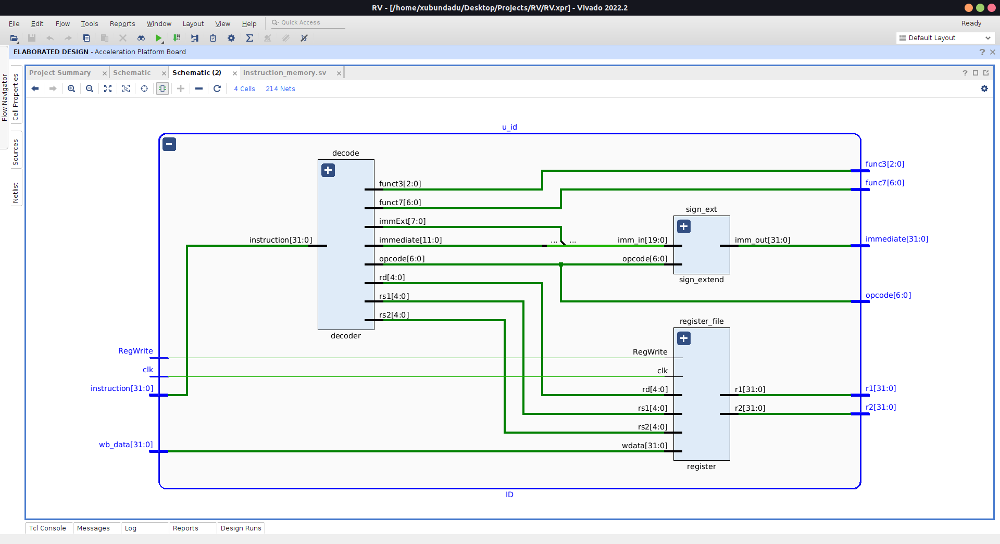
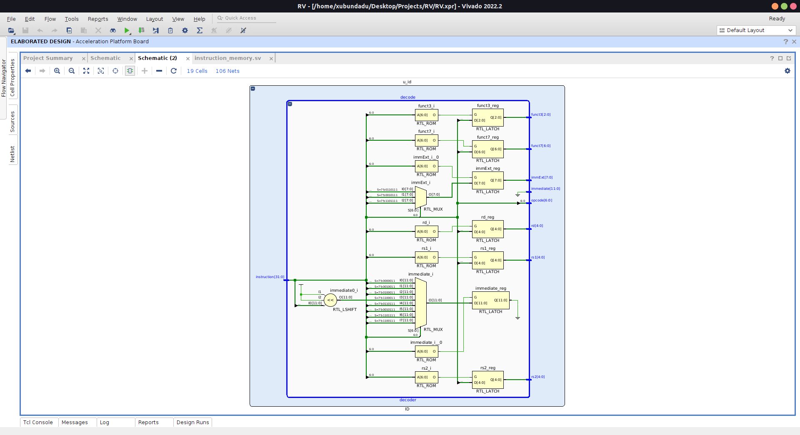
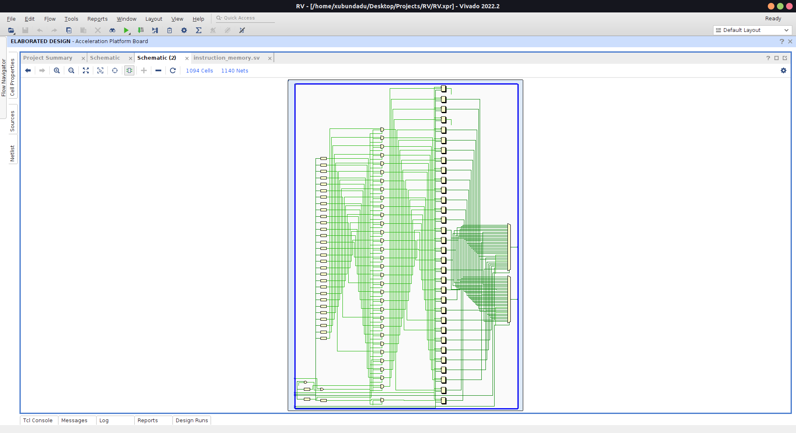
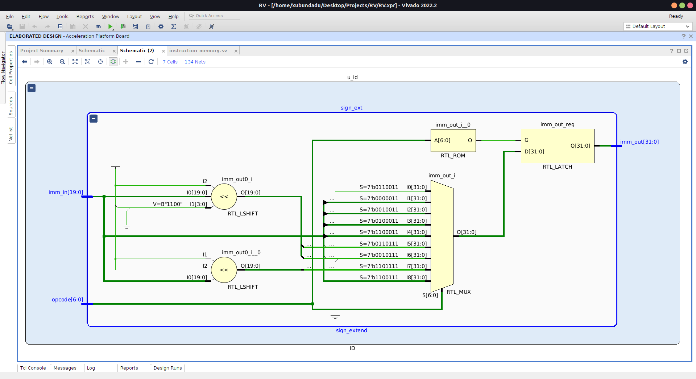

# Instruction Decode Stage

# [src/ID.sv](src/ID.sv)

# Decoder

# [src/decoder.sv](src/decoder.sv)

# Register file

# [src/register_file.sv](src/register_file.sv)

# Sign Extender

# [src/sign_extender.sv](src/sign_extender.sv)
