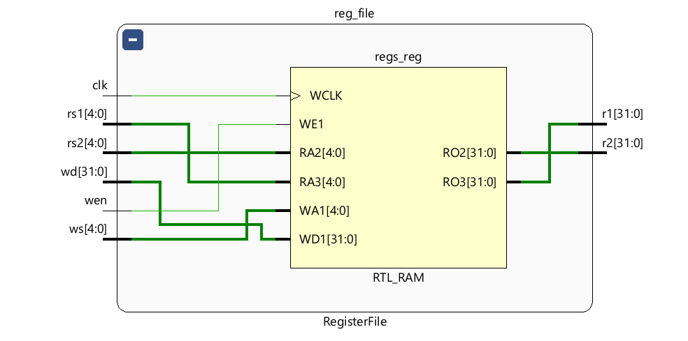

# Program 1: 
### Statement: Write a SV program for Instruction Decode Stage

### Name of file:
COD-Lab/week7/w7p1.sv

### RTL Snapshot

# Program 2: 
### Statement: Write a SV program for the Decoder

### Name of file:
COD-Lab/week7/w7p2.sv

### RTL Snapshot

# Program 3: 
### Statement: Write a SV program for the Register File

### Name of file:
COD-Lab/week7/w7p3.sv

### RTL Snapshot

# Program 4: 
### Statement: Write a SV program for the Immediate Unit

### Name of file:
COD-Lab/week7/w7p4.sv

### RTL Snapshot

