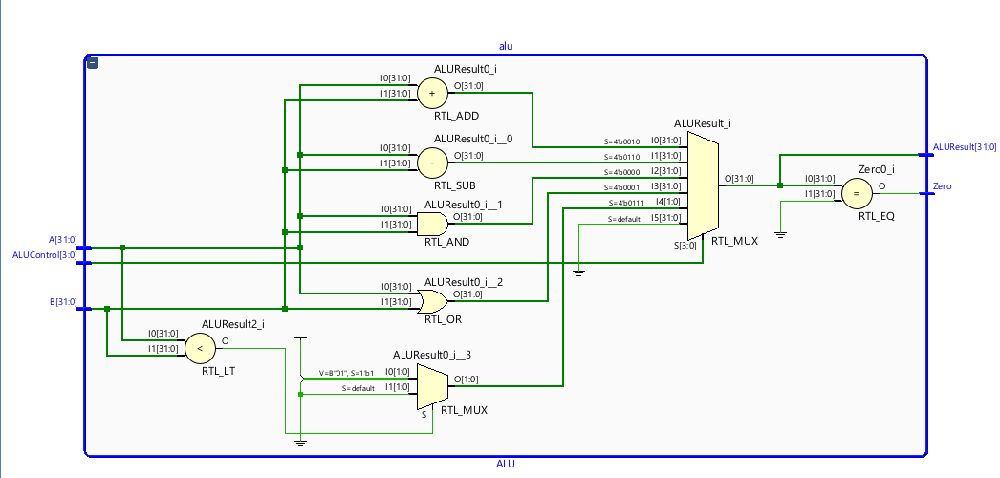

# Program 1: 
### Statement: Write a SV program for Instruction Execute Stage

### Name of file:
COD-Lab/week8/w8p1.sv

### RTL Snapshot

# Program 2: 
### Statement: Write a SV program for the ALU

### Name of file:
COD-Lab/week8/w8p2.sv

### RTL Snapshot
