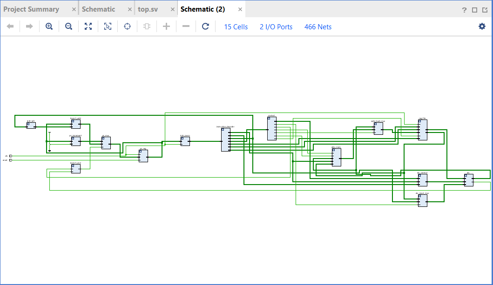

# Program 1: 
### Statement: Write a SV program for Memory Access & Writeback Stage

### Name of file:
COD-Lab/week9/w9p1.sv

### RTL Snapshot

# Program 2: 
### Statement: Write a SV program for Data memory

### Name of file:
COD-Lab/week9/w9p2.sv

### RTL Snapshot
